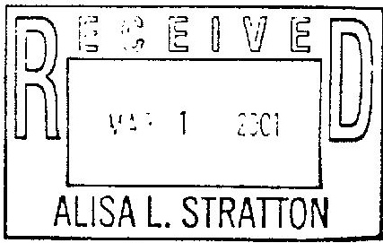

## Wachtell, Lipton, Rosen & Katz 

51West52StreetNewYork,NewYork10019

(212) 403-1000

FACSIMILETRANSMITTAL 

No.OF PAGES:(including this page)

Ifyou do not rercive all the pagcs, please telepkunc (212) 403-1520 ienmediately.

<html><body><table border="1"><tbody><tr><td>Name/Company</td><td>Fax Number</td><td>Telephone Number</td><td>Sent</td><td></td></tr><tr><td>Charles S. Duggan Davis Polk & Wardwell</td><td>(212)450-5578</td><td>(212)450-4785</td><td></td><td>(1)</td></tr><tr><td>Thomas F.McKim R.J.Reynolds Tobacco Holdings,Inc.</td><td>(336)741-0671</td><td>(336)741-3348</td><td></td><td>(2)</td></tr><tr><td>Neil E.Mcllen Brown & Williamson Tobacco Company</td><td>(502)568-7676</td><td>(502)568-7064</td><td></td><td>(3)</td></tr><tr><td>Stephen R. Patton Kirkland & Ellis</td><td>(312)861-2200</td><td>(312) 861-2406</td><td></td><td>(4)</td></tr><tr><td>Brian McGinn Lorillard Tobacco Company</td><td>(336)335-7722</td><td>(336)335-7000</td><td></td><td>(5)</td></tr><tr><td>(336)335-7707</td><td>(336)335-7718</td><td></td><td>(6)</td><td>Ronald S.Milstcin Lorillard Tobacco Company</td></tr><tr><td>Alisa Stratton Philip Morris Companies Inc.</td><td>(917)663-5344</td><td>(917)663-2404</td><td></td><td>(7)</td></tr><tr><td>(917)663-5979</td><td>(917)663-3679</td><td></td><td>(8）</td><td>James A. Wilson Philip Morris Companies Inc.</td></tr></tbody></table></body></html>

## Mcssage:

Attached (asI have discussed with you or will discuss with you) is reviscd profit adjustncnt languagc for the AmcndedMinnesota Settlement Agreernent.

JRB 

2085601691

THE INFORMATIONCONTAINEDIN THISFACSIMILETRANSMITTALISINTENDEDONLYFORTHEPERSONAL AND CONFIDENTIAL USE OF THE DESIGNATED RECIPIENT NAMED ABOVE.Thistraccour ic transmitta is not the intandod reclplant or an agent responslble for dellvaring it to tho intondad raciplent, you are hcroby nouflod that you have racelved this transmlttal in arror, and that any roviow, disseminab on, distribution or copying of thig tranamittal is strictly prohibted. If you havo received this in error, please notity us immodiately by telephone (cad us colioct at 212-4o3-1s2o) and returm the orgina transmitta to us by mait. Thank you.

